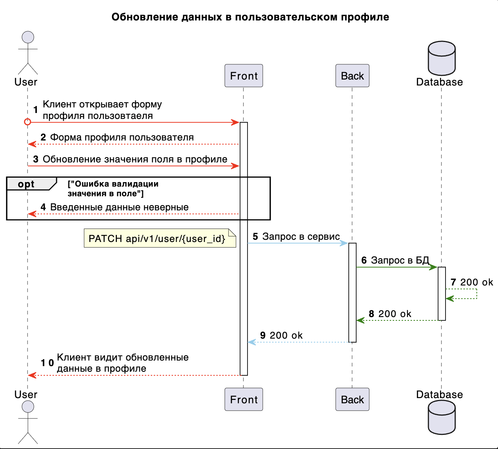

# Задача 1:

## **User Story**:

Я как клиент банка, хочу иметь возможность обновлять информацию о своем профиле, включая имя, фамилию, возраст, электронную почту и номер телефона, чтобы поддерживать актуальные данные.

## **Функциональные требования**:
    
    Реализовать функционал для возможности редактирования пользовательского профиля.
        1. Создать валидацию введенных данных в полях почтовый адрес и номер телефона
        2. Создать возможность сохранения обновленных данных в профиле

## **Ограничения на UI**:

        1. Доступные поля для редактирования: имя, фамилия, возраст, электронная почта и номер телефона
        2. Недоступные поля для редактирования будут выделены серым цветам

## **Use Case**:
    Редактирование информации в профиле клиента:

    Краткое описание: У пользователя должна быть возможность отредактировать данные в профиле приложения банка
    Действующие лица: Пользователь банка, приложение банка (веб, мобильное), сервис клиентов
    Триггер: У пользователя обновились контактные данные
    Предусловие: Пользователь авторизовался в приложении
    Постусловие: ---
    Результат: В случае успешного выполнения основного потока, внесенные изменения сохранены в БД сервиса, пользователь увидит изменения в приложении

    Основной поток: Внести изменения в профиле клиента
        1. Пользователь перешел к функционалу просмотра и внесения изменений в профиле приложения
        2. Пользователь отредактировал доступные поля для редактирования
        3. Пользователь выбирает "Сохранить" изменения 
        5. Система сохраняет изменения в БД сервиса клиентов
        6. Система отображет нотификацию "Изменения сохранены"
    
    Альтернативный поток 1: Пользователь не подтвердил сохранение изменений
        2а. Пользователь отредактировал данные в поле 
        3а. Пользователь не сохранил изменения
        4а. Система закрывает режим редактирования строки, внесенные изменения не сохраняются

    Альтернативный поток 2: Пользователь отменил сохранение изменений
        2а. Пользователь отредактировал данные в поле 
        3а. Пользователь отменил изменения
        4а. Система закрывает режим редактирования строки, внесенные изменения не сохраняются

    Поток исключения 1: Пользователь не заполнил все обязательные поля
        2а. Пользователь отредактировал данные в поле, но оставил хотя бы одно поле пустым
        3а. Система выделяет инпут красным и отображает подпись "Обязательное поле" 

    Требования: Перечень полей доступных для редактирования
        - Имя
        - Фамилия
        - Возраст
        - Электронная почта
        - Номер телефона

## **Диаграмма последовательности**:



## **Контракт взаимодействия с фронтом**:

### Запрос на изменения данных в профиле пользователя ###
### Формат сообщения
```txt
type: REST API
endpoint: [PATCH] /api/v1/user/{user_id} 
```

### Структура запроса:
| Артибут  | Описание | Тип данных  | Кратность |
| ------------- | ------------- | ------------- | ------------- |
| `firstName`  | Имя клиента  | string  | 1..1  |
| `lastName`  | Фамилия клиента  | string  | 1..1  |
| `age`  | Возраст  | int  | 1..1  |
| `emailAddress`  | Почтовый адрес  | string  | 1..1  |
| `phoneNumber`  | Номер телефона  | string  | 1..1  |

### Структура ответа:
| Артибут  | Описание | Тип данных  | Кратность |
| ------------- | ------------- | ------------- | ------------- |
| `message`  | Описания сообщения  | string  | 1..1  |

### Описание работы эндпойнта: 
Для конечной точки реализовано частичное обновление полей методом **Patch**, соответственно если необхоидмо изменить только имя, то будет отправлен body с полем firstName, если надо будет изменить имя и фамилию, то будет отправлен body с полем firstName и lastName, если надо будет изменить все поля, то будет отправлена вся структура запроса. 

Примеры ниже.

#### 1.1. Пример запроса в случае изменения имени:
#### [PATCH] /api/v1/user/f1731421-f97b-4343-b076-a7460131cf3f 
```json
{
    "firstName": "Ivan"
}
```

#### 1.2. Пример ответа:
```json
{
    "message": "Данные успешно изменены"
}
```

#### 2.1. Пример запроса в случае изменения имени и фамилии:
#### [PATCH] /api/v1/user/f1731421-f97b-4343-b076-a7460131cf3f 
```json
{
    "firstName": "Ivan",
    "lastName": "Ivanov"
}
```

#### 2.2. Пример ответа:
```json
{
    "message": "Данные успешно изменены"
}
```

#### 2.1. Пример запроса в случае изменения всех полей
#### [PATCH] /api/v1/user/f1731421-f97b-4343-b076-a7460131cf3f 
```json
{
    "firstName": "Ivan",
    "lastName": "Ivanov",
    "age": 30,
    "emailAddress": "Ivan.Ivanov@gmail.com",
    "phoneNumber": "+7(999)100-20-30"
}
```

#### 2.2. Пример ответа:
```json
{
    "message": "Данные успешно изменены"
}
```

### Модель данных:

#### База данных: MS SQL
#### Таблица User (пользователи)
| Артибут  | Описание | Тип данных SQL | Кратность |
| ------------- | ------------- | ------------- | ------------- |
| `UserId`  | Идентификатор пользователя  | uniqueidentifier  | 1..1  |
| `FirstName`  | Имя клиента  | nvarchar(250)  | 1..1  |
| `LastName`  | Фамилия клиента  | nvarchar(250)  | 1..1  |
| `Age`  | Возраст  | int  | 1..1  |
| `EmailAddress`  | Почтовый адрес  | nvarchar(300)  | 1..1  |
| `PhoneNumber`  | Номер телефона  | nvarchar(25)  | 1..1  |
| `CreatedAt`  | Дата и время создания записи  | datetime2  | 1..1  |
| `ModifiedAt`  | Дата и время изменения записи  | datetime2  | 1..1  |